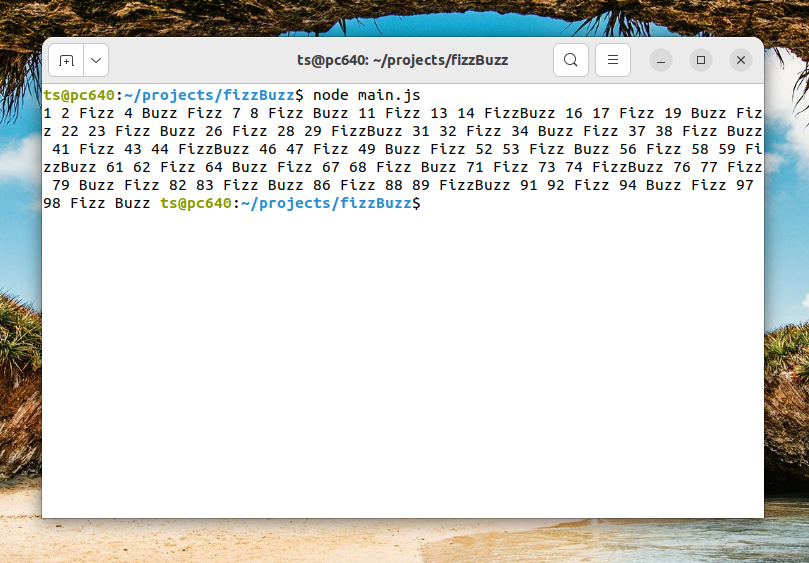

This project displays numbers from 1 to 100, but with 3 conditions.
They are:
1.  Change the number to "Fizz" if the number is divisible by 3.
2.  Change to "Buzz" if it is divisible by 5.
3.  Change to "FizzBuzz" if it is divisible by 3 and 5.

Output:

